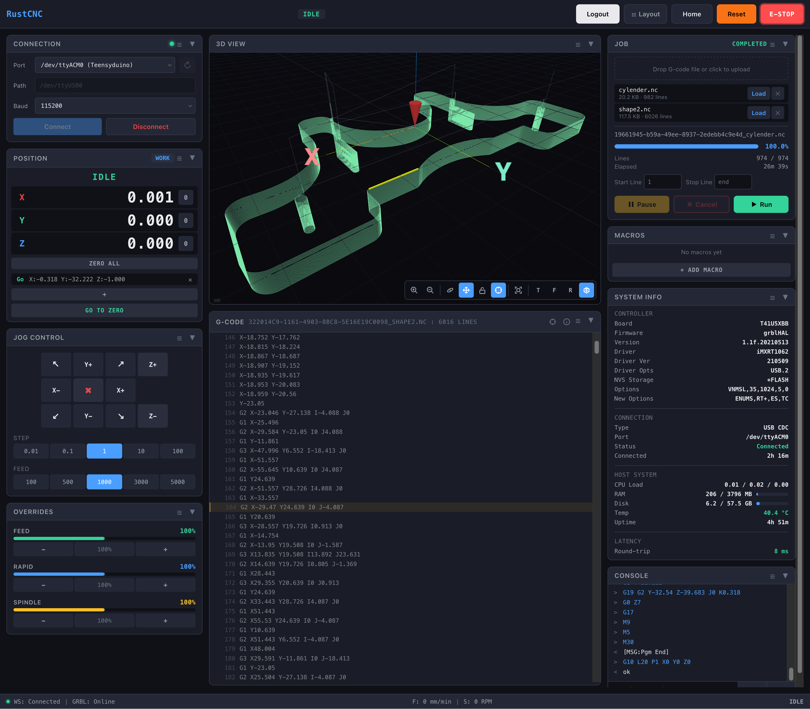

# RustCNC

Rust-based CNC controller (GRBL/grblHAL) with a web UI. Designed to run on a Raspberry Pi 4 and stream G-code over USB serial.

## Repo layout

- `crates/rustcnc-server`: Axum HTTP/WebSocket server + embedded UI
- `crates/rustcnc-streamer`: Dedicated thread that talks to the controller over serial
- `crates/rustcnc-planner`: Job planning + progress estimation
- `frontend`: SolidJS UI (built into `frontend/dist` and embedded into the server binary)

## Build (local dev)

Prereqs: Rust (MSRV is declared in `Cargo.toml`) and Node.js + npm.

1) Build the UI (required for embedding):
- `cd frontend && npm ci && npm run build`

2) Run the server:
- `cargo run -p rustcnc-server -- --config config/default.toml`

Then open `http://localhost:8888/` (or whatever `server.port` is set to in your config).

### Using the Vite dev server

If you run `npm run dev` (default `http://localhost:5173`), you must allow that origin for `/ws` and unsafe API calls:

- In your config:
  - `server.allowed_origins = ["http://localhost:5173"]`

## Build (release)

- `cd frontend && npm ci && npm run build`
- `cargo build --release -p rustcnc-server`

Binary output: `target/release/rustcnc` (host build).

## Raspberry Pi build + deploy

Cross-build (macOS/Linux) and deploy scripts live in `scripts/`.

- Cross-build:
  - `./scripts/cross-pi.sh aarch64-unknown-linux-gnu`
  - Output: `target/aarch64-unknown-linux-gnu/release/rustcnc`

- Deploy (copies binary + config):
  - `./scripts/deploy-pi.sh user@pi-host /home/user/rustcnc`

Or do a full install (auto-detects Pi arch, builds, uploads a tarball, runs the installer):
- `./scripts/install-pi.sh user@pi-host`
- `./scripts/install-pi.sh --prefix /opt/rustcnc user@pi-host`

## Installing from a release tarball (recommended for distribution)

1) Copy the tarball to the Pi and extract it:
- `scp dist/rustcnc-pi-aarch64-unknown-linux-gnu.tar.gz pi@pi-host:~/`
- `ssh pi@pi-host 'tar -xzf rustcnc-pi-aarch64-unknown-linux-gnu.tar.gz'`

2) Run the installer on the Pi:
- `ssh pi@pi-host 'cd rustcnc-pi-aarch64-unknown-linux-gnu && sudo ./install.sh'`

User guide: `USER_GUIDE.md`.

### systemd service (recommended)

Example unit file: `packaging/systemd/rustcnc.service`.

## Configuration

Config is TOML. See:
- `config/default.toml` (dev-friendly defaults)
- `config/pi4.toml` (Pi 4 oriented defaults)

Key sections:
- `[server]`: host/port, websocket tick rates, `allowed_origins`
- `[serial]`: `default_port` (optional), baud, status poll rate
- `[streamer]`: GRBL RX buffer size, optional CPU pinning, optional RT priority
- `[logging]`: level, optional `log_dir`, console output
- `[files]`: upload directory + max upload size
- `[auth]`: optional Web UI login (username + password hash via `rustcnc --hash-password-stdin`)

## License

Dual-licensed under Apache-2.0 OR MIT. See `LICENSE-APACHE` and `LICENSE-MIT`.
